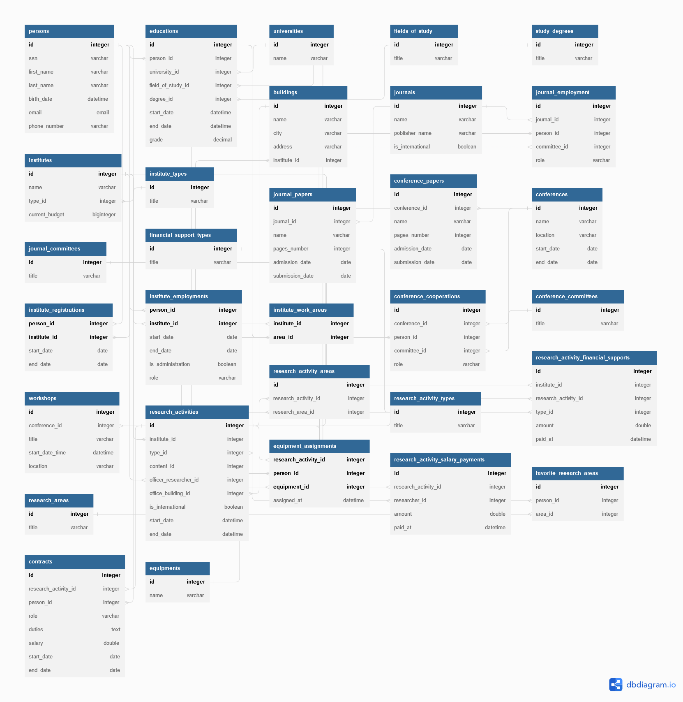
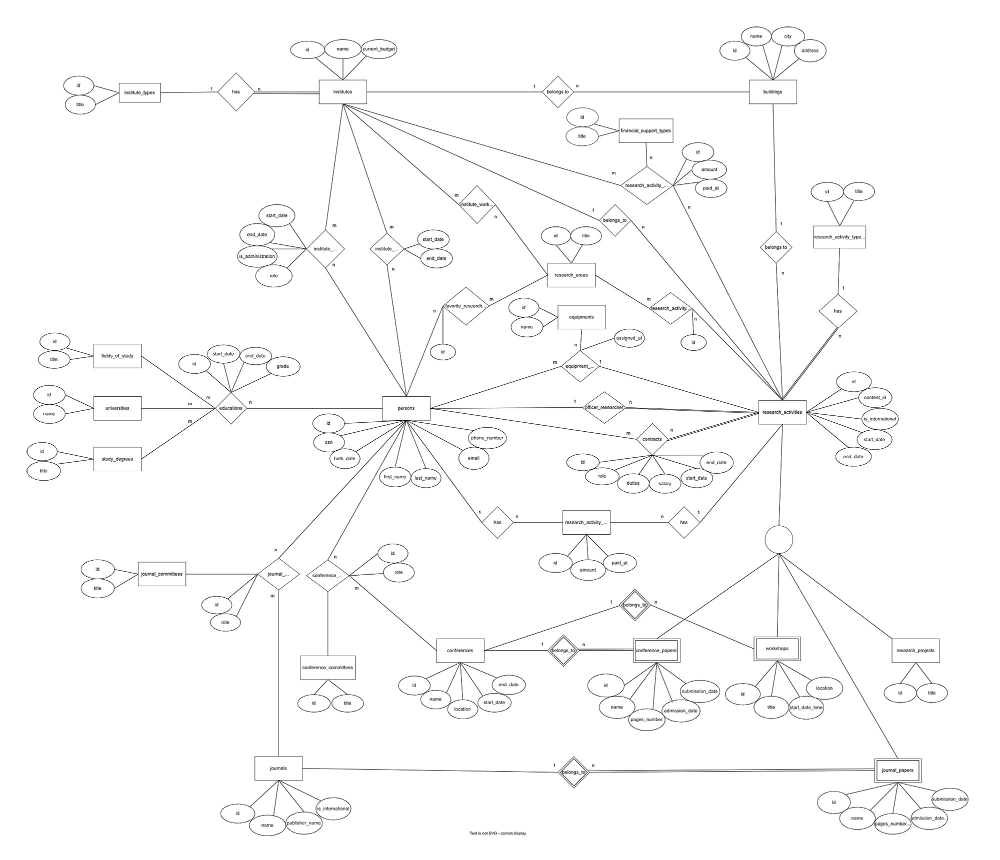

### University's database design course final project:
# Research Activities Information System Database

This project is a SQL database to keep the data of the researchers and their research activities, containing journal papers, conference papers, workshops, and also the data of the institutes, their financial records, research areas, managers, and members.

We used draw.io to draw the entity relationship diagram, dbdiagrams.io to design our relational model diagram and MySQL to implement the database, and mockaroo.com to generate mock data for the database.

---
## SQL Files
[Database Schema](db-schema.sql)

[Mock Data](db-data.sql)

[MySQL Workbench Model](db-model.mwb)

---
## RM Diagram

[PDF Version](RMDiagram.pdf)

---
## ER Diagram

